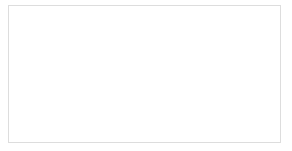
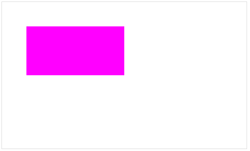
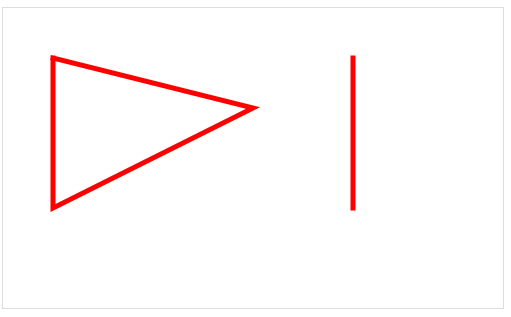
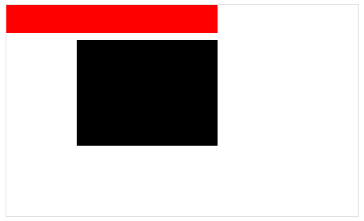
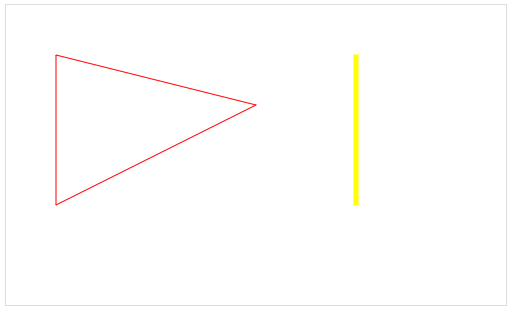
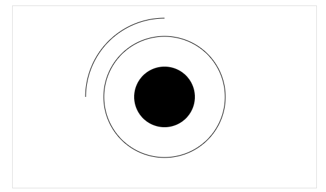
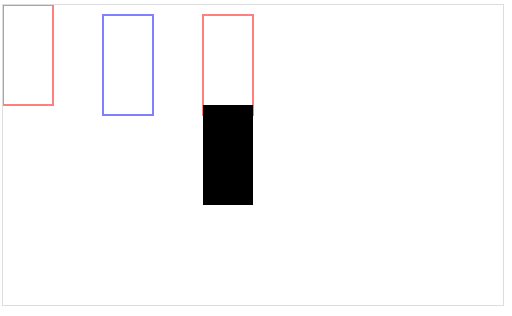
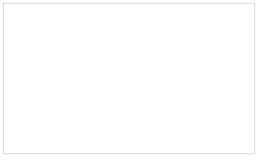

#大家都能看懂的 canvas入门基础教程

---
原文链接: [http://www.shitu91.com/cms/canvasSub/index.html](http://www.shitu91.com/cms/canvasSub/index.html)

<!-- MarkdownTOC -->

- [01.canvas简单的认识](#01canvas简单的认识)
- [02.绘制 一个带有填充颜色的 矩形相关代码](#02绘制-一个带有填充颜色的-矩形相关代码)
- [03.画线](#03画线)
- [04.画矩形](#04画矩形)
- [05.路径的开始与关闭](#05路径的开始与关闭)
- [06.canvas 画圆 画弧](#06canvas-画圆-画弧)
- [07.canvas 添加图片  添加文字](#07canvas-添加图片--添加文字)
- [08.canvas 橡皮擦  物体运动\(本质是图形不断的擦除与绘制\)](#08canvas-橡皮擦--物体运动本质是图形不断的擦除与绘制)
- [09. canvas 鼠标画笔](#09-canvas-鼠标画笔)
- [10.canvas 渐变线性渐变](#10canvas-渐变线性渐变)
- [11.canvas 渐变之径向渐变](#11canvas-渐变之径向渐变)
- [12.canvas 填充--图案](#12canvas-填充--图案)
- [13.canvas 图片 之深入谈](#13canvas-图片-之深入谈)
- [14.canvas save && restore](#14canvas-save--restore)
- [15.canvas 坐标操作  移动\(translate\) 旋转\(rotate\) 缩放\(scale\)](#15canvas-坐标操作--移动translate-旋转rotate-缩放scale)
- [16.像素操作](#16像素操作)
- [16.canvas像素操作_补充](#16canvas像素操作补充)
- [17.canvas 阴影](#17canvas-阴影)
- [18.canvas 裁剪](#18canvas-裁剪)
- [19.canvas 图片保存](#19canvas-图片保存)
- [20.图形组合](#20图形组合)
- [21. canvas 事件操作](#21-canvas-事件操作)

<!-- /MarkdownTOC -->


<a name="01canvas简单的认识"></a>
01.canvas简单的认识
---

> canvas 是html5提供给我们的一个绘图标签
> 默认大小 300X150   背景透明

``` html
<!DOCTYPE html>
<html lang="en">
<head>
    <meta charset="UTF-8">
    <title>canvas简单的认识</title>
</head>
<body>
    <canvas id="myCanvas" style="border:1px solid #ddd;display:block;margin:20px auto;"></canvas>

</body>
</html>
```
效果图 如下 [查看案例](demo01.html)




<a name="02绘制-一个带有填充颜色的-矩形相关代码"></a>
02.绘制 一个带有填充颜色的 矩形相关代码
---


``` javascript
        var myCanvas=document.getElementById("myCanvas");
        myCanvas.width="500";
        myCanvas.height="300";

        var cxt=myCanvas.getContext("2d");

        cxt.fillStyle="#f0f";
        cxt.fillRect(50,50,200,100);
```


效果图 如下 [查看案例](demo02.html)




<a name="03画线"></a>
03.画线
---

``` javascript
<script>
        var myCanvas=document.getElementById("myCanvas");
        myCanvas.width="500";
        myCanvas.height="300";

        var cxt=myCanvas.getContext("2d");
        //画三角形
        cxt.moveTo(50,50);
        cxt.lineTo(250,100);
        cxt.lineTo(50,200);
        cxt.lineTo(50,50);

        //画直线
        cxt.moveTo(350,50);
        cxt.lineTo(350,200);

        //定义画线样式
        cxt.strokeStyle="red";
        cxt.lineWidth="5";

        cxt.lineCap="round";

        cxt.stroke();
    
```

效果图 如下 [查看案例](demo03.html)




<a name="04画矩形"></a>
04.画矩形
---

``` javscript
<script>
        var myCanvas=document.getElementById("myCanvas");
        myCanvas.width="500";
        myCanvas.height="300";

        var cxt=myCanvas.getContext("2d");
        //方法一
    
        cxt.moveTo(100,50);
        cxt.lineTo(300,50);
        cxt.lineTo(300,200);
        cxt.lineTo(100,200);
        cxt.lineTo(100,50);
        cxt.fill();
        //cxt.stroke();

        //方法二
        // /cxt.strokeStyle="red";
        cxt.fillStyle="red";
        cxt.fillRect(0,0,300,40);
        //cxt.strokeRect(0,0,300,40);

    </script>
```

效果图 如下 [查看案例](demo04.html)




<a name="05路径的开始与关闭"></a>
05.路径的开始与关闭
---


``` javascript
    <script>
        var myCanvas=document.getElementById("myCanvas");
        myCanvas.width="500";
        myCanvas.height="300";

        var cxt=myCanvas.getContext("2d");
        //方法一
    
        cxt.moveTo(100,50);
        cxt.lineTo(300,50);
        cxt.lineTo(300,200);
        cxt.lineTo(100,200);
        cxt.lineTo(100,50);
        cxt.fill();

        //cxt.stroke();

        //方法二
        //cxt.strokeStyle="red";
        //cxt.strokeRect(0,0,300,40);

        cxt.fillStyle="red";
        cxt.fillRect(0,0,300,40);
    
```

效果图 如下 [查看案例](demo05.html)



<a name="06canvas-画圆-画弧"></a>
06.canvas 画圆 画弧
---

``` javascript
<script>
        var myCanvas=document.getElementById("myCanvas");
        myCanvas.width="500";
        myCanvas.height="300";

        var cxt=myCanvas.getContext("2d");
        //空心圆
        cxt.beginPath()
            cxt.arc(250,150,100,0,Math.PI*2);
        cxt.closePath();
        cxt.stroke();

        //空心圆
        cxt.beginPath()
            cxt.arc(250,150,50,0,Math.PI*2);
        cxt.closePath();
        cxt.fill();

        //弧度
        cxt.beginPath()
            cxt.arc(250,150,130,Math.PI*3/2,Math.PI,true);
            cxt.stroke();
        cxt.closePath();

```

效果图 如下 [查看案例](demo06.html)



<a name="07canvas-添加图片--添加文字"></a>
07.canvas 添加图片  添加文字
---

``` javascript
<script>
        var myCanvas=document.getElementById("myCanvas");
        myCanvas.width="500";
        myCanvas.height="300";

        var cxt=myCanvas.getContext("2d");
        
        //添加图片
        var img=new Image();
        img.src="images/meizi.jpg";
        img.onload=function(){
            cxt.drawImage(img,85,40);
        }

        //添加文字
        cxt.font="30px Arial";

        cxt.fillStyle="red";
        cxt.fillText("我女朋友",380,290);

        cxt.strokeStyle="red";
        cxt.strokeText("我女朋友",380,290);

   
```
    
效果图 如下 [查看案例](demo07.html)


<a name="08canvas-橡皮擦--物体运动本质是图形不断的擦除与绘制"></a>
08.canvas 橡皮擦  物体运动(本质是图形不断的擦除与绘制)
---

```javascript
<script>
        var myCanvas=document.getElementById("myCanvas");
        myCanvas.width="500";
        myCanvas.height="300";

        var cxt=myCanvas.getContext("2d");

        //圆
        var x=10,y=10;
        var a=490,b=290;
        var duration=2000;
        var cishu=2000/30;
        var xstep=(a-x)/cishu;
        var ystep=(b-y)/cishu;
        

        function huayuan(x,y){
            cxt.beginPath();
            cxt.arc(x,y,10,0,Math.PI*2);
            cxt.fillStyle="red";
            cxt.fill();
        }

        huayuan();
        var timer=setInterval(function(){
             //橡皮擦
            cxt.clearRect(x-11,y-11,22,22);

            x+=xstep;
            y+=ystep;

            if(x>=a){
                x=a;
                y=b;
            }
            huayuan(x,y);

        },30);

```

效果图 如下 [查看案例](demo08.html)


<a name="09-canvas-鼠标画笔"></a>
09. canvas 鼠标画笔 
---

```javascript
<script>
        var myCanvas=document.getElementById("myCanvas");
        myCanvas.width="500";
        myCanvas.height="300";

        var cxt=myCanvas.getContext("2d");

        var canvaL=myCanvas.offsetLeft;
        var canvaT=myCanvas.offsetTop;


        myCanvas.onmousedown=function(e){
            var ev=e||window.event;
            var left=ev.clientX;
            var top=ev.clientY;
            var x=left-canvaL;
            var y=top-canvaT;

            cxt.moveTo(x,y);
            myCanvas.onmousemove=function(e){
                var ev=e||window.event;
                var left=ev.clientX;
                var top=ev.clientY;
                var x=left-canvaL;
                var y=top-canvaT;
                cxt.lineTo(x,y);
            
                cxt.stroke();


            }

            myCanvas.onmouseup=function(){
                myCanvas.onmouseup=null;
                myCanvas.onmousemove=null;
            }
            myCanvas.onmouseout=function(){
                myCanvas.onmouseup=null;
                myCanvas.onmousemove=null;
                myCanvas.onmouseout=null;
            }


        }
    

```

 效果图 如下  [查看案例](demo09.html)


<a name="10canvas-渐变线性渐变"></a>
10.canvas 渐变线性渐变
---

``` javascript
<script>
        var myCanvas=document.getElementById("myCanvas");
        myCanvas.width="500";
        myCanvas.height="300";
        var ctx=myCanvas.getContext("2d");

        //创建线性渐变对象
        var lg=ctx.createLinearGradient(10,10,210,110);
        lg.addColorStop(0,"red");
        lg.addColorStop(1,"blue");

        //带线性渐变矩形
        ctx.fillStyle=lg;
        ctx.fillRect(10,10,200,100);

        //带线性渐变圆
        var lg1=ctx.createLinearGradient(80,130,140,200);
        lg1.addColorStop(0,"green");
        lg1.addColorStop(1,"yellow");

        ctx.beginPath();
        ctx.arc(105,160,50,0,Math.PI*2);
        ctx.fillStyle=lg1;
        ctx.fill();
        ctx.closePath();

    </script>
```

效果图 如下 [查看案例](demo10.html)


<a name="11canvas-渐变之径向渐变"></a>
11.canvas 渐变之径向渐变
---

```javascript
<script>
        var myCanvas=document.getElementById("myCanvas");
        myCanvas.width="500";
        myCanvas.height="300";
        var ctx=myCanvas.getContext("2d");

        //创建径向渐变对象
        var rg=ctx.createRadialGradient(110,110,1,110,110,110);

        rg.addColorStop(0,"#f00");
        rg.addColorStop(0.5,"rgb(238,182,231)");
        rg.addColorStop(1,"blue");

        //带径向渐变矩形
        ctx.fillStyle=rg;
        ctx.fillRect(10,10,200,200);

        //创建径向渐变的圆

        var rg1=ctx.createRadialGradient(310,61,1,310,111,100);
        rg1.addColorStop(0,"#fff");
        rg1.addColorStop(1,"black");

        ctx.beginPath();
        ctx.arc(310,111,100,0,Math.PI*2);
        ctx.fillStyle=rg1;
        ctx.fill();
        ctx.closePath();

    </script>
```

效果图 如下 [查看案例](demo11.html)


<a name="12canvas-填充--图案"></a>
12.canvas 填充--图案
---
``` javascript
<script>
        var myCanvas=document.getElementById("myCanvas");
        myCanvas.width="500";
        myCanvas.height="300";
        var ctx=myCanvas.getContext("2d");

        var img=new Image();
        img.src="images/flower.jpg";
        
        img.onload=function(){
            var tuan=ctx.createPattern(img,"repeat");

            ctx.fillStyle=tuan;
            ctx.fillRect(0,0,500,300);
        }
    </script>
```
效果图如下:[查看案例](demo12.html)


<a name="13canvas-图片-之深入谈"></a>
13.canvas 图片 之深入谈
---

``` javascript
<script>
        var myCanvas=document.getElementById("myCanvas");
        myCanvas.width="500";
        myCanvas.height="300";
        var ctx=myCanvas.getContext("2d");

        //画图 女汉子
        var nvhanziImg=new Image();
        nvhanziImg.src="images/nvhanzi.jpg";
        nvhanziImg.onload=function(){

            //ctx.drawImage(nvhanziImg,dx,dy,dw,dh);

            ctx.drawImage(nvhanziImg,225,125,50,50);
        }
        
        
        //2 画精灵图片
        // source源  destination 目标地
        var nvjingli=new Image();
        nvjingli.src="images/jinglingnvhai.jpg";
        var nv2={
                x:82,
                y:0,
                w:84,
                h:110
        };


        nvjingli.onload=function(){

        //语法 ctx.drawImage(nvjingli,s.x,s.y,s.w,s.h,d.x,d.y,d.w,d.h);

        ctx.drawImage(nvjingli,nv2.x,nv2.y,nv2.w,nv2.h,0,0,nv2.w/2,nv2.h/2);


        }
        
        //3.圣诞老人驾车
        var shengdanP=[
            {
                    x:0,
                    y:0,
                    w:220,
                    h:80
            },
            {
                    x:220,
                    y:0,
                    w:220,
                    h:80
            },
            {
                    x:440,
                    y:0,
                    w:220,
                    h:80
            },
            {
                    x:660,
                    y:0,
                    w:220,
                    h:80
            },
        ];
        var shengdanImg=new Image();
        shengdanImg.src="images/christmas.jpg";

        shengdanImg.onload=function(){
    
            setInterval(pao,100);
        }
    
        
        var index=0;
        function pao(){
            if(index==shengdanP.length){
                index=0;
            }
            var sx=shengdanP[index].x;
            var sy=shengdanP[index].y;
            var sw=shengdanP[index].w;
            var sh=shengdanP[index].h;

            ctx.drawImage(shengdanImg,sx,sy,sw,sh,10,125,sw*2/3,sh*2/3);
            index++;

        }

    </script>
```

效果图 如下 [查看案例](demo13.html)


<a name="14canvas-save--restore"></a>
14.canvas save && restore
---

>保存或者恢复 canvas 里的状态 (填充，描边，渐变，坐标位移,裁切)

```javascript
<script>
    
        var myCanvas=document.getElementById("myCanvas");

        myCanvas.width="500";
        myCanvas.height="300";
        var ctx=myCanvas.getContext("2d");
            
        var lg=ctx.createLinearGradient(200,100,250,200);
        lg.addColorStop(0,"red");
        lg.addColorStop(1,"blue");

        ctx.strokeStyle="red";
        ctx.strokeRect(0,0,50,100);
        ctx.save();

        ctx.fillStyle=lg;
        ctx.strokeStyle="blue";
        ctx.strokeRect(100,10,50,100);
        ctx.save();

        ctx.restore();
        ctx.restore();
        ctx.strokeRect(200,10,50,100);
        ctx.fillRect(200,100,50,100);
        
    </script>
```

效果图如下 你是否能理解下面的绘制呢？  [查看案例](demo14.html)

;

<a name="15canvas-坐标操作--移动translate-旋转rotate-缩放scale"></a>
15.canvas 坐标操作  移动(translate) 旋转(rotate) 缩放(scale)
---

>为了不影响canvas里其它的对象，我们在进行坐标变换前,先保存一下canvas状态
>做完变换操作以后恢复原状态
```javascript

   <script>
    
        var drawRect=document.getElementById("drawRect");
  

        myCanvas.width="500";
        myCanvas.height="300";
        var ctx=myCanvas.getContext("2d");

    
        //绘制球
        var x=0,y=0;
        setInterval(function(){
            ctx.save();

            ctx.clearRect(x-11,y-11,22,22);

            x+=5;
            y+=5;
            ctx.translate(x,y);

        
            ctx.beginPath();
            ctx.arc(0,0,10,0,2*Math.PI,false);
            ctx.stroke();
            ctx.closePath();

            ctx.restore();

        },100);

    </script>
```

效果图如下 [查看案例](demo15.html)




<a name="16canvas-图形组合与混合-图片保存-裁剪-阴影-像素操作-事件操作"></a>

<a name="16像素操作"></a>
16.像素操作
---
```html
    <canvas id="myCanvas" style="border:1px solid #ddd;display:block;margin:auto">
    </canvas>
    <canvas id="myCanvas2" style="border:1px solid red;display:block;margin:auto">
    </canvas>
```
```javascript
 <script>
    
        var myCanvas=document.getElementById("myCanvas");
        var myCanvas2=document.getElementById("myCanvas2");

        myCanvas2.width=myCanvas.width="500";
        myCanvas2.height=myCanvas.height="300";

        var ctx=myCanvas.getContext("2d");
        var ctx2=myCanvas2.getContext("2d");

        ctx.fillRect(10,10,200,100);
        ctx.beginPath();
        ctx.arc(200,100,50,0,Math.PI*2);
        ctx.closePath();
        ctx.fillStyle="red";
        ctx.fill();
    
        var imgData=ctx.getImageData(0,0,500,300);
        ctx2.putImageData(imgData,0,0);

    </script>

```
效果图如下 [查看案例](demo16.html)

 

<a name="16canvas像素操作补充"></a>
16.canvas像素操作_补充
---
```html
    <div style="width:300px;margin:auto">
        原图
        
        canvas处理后
    </div>
    <canvas id="myCanvas" style="border:1px solid #ddd;display:block;margin:auto">
    </canvas>
```
```javascript
<script>
        var CANVAS_WIDTH=300;
        var CANVAS_HEIGHT=200;

        var myCanvas=document.getElementById("myCanvas");
        myCanvas.width=CANVAS_WIDTH;
        myCanvas.height=CANVAS_HEIGHT;


        var ctx=myCanvas.getContext("2d");

        var img=new Image();
        img.src="images/twodog.jpg";
        img.onload=function(){
            ctx.drawImage(img,0,0,CANVAS_WIDTH,CANVAS_HEIGHT);


            var imgData=ctx.getImageData(0,0,CANVAS_WIDTH,CANVAS_HEIGHT);
            var pixcelNums=CANVAS_WIDTH*CANVAS_HEIGHT;
            for(var i=0;i<pixcelNums;i++){
                imgData.data[i*4+0]=0;
                /*imgData.data[i*4+1]=0;
                imgData.data[i*4+2]=0;
                imgData.data[i*4+3]=0;*/
            }

            ctx.putImageData(imgData,0,0);
        }

    </script>
```
效果图如下: [查看案例](demo16_02.html)


<a name="17canvas-阴影"></a>
17.canvas 阴影
---

| 说明          |    属性       |
| ------------- |:-------------:|
| 阴影偏移      | shadowOffsetX,shadowOffsetY |
| 阴影颜色      | shadowColor      | 
| 阴影模糊      | shadowBlur      |

``` html
<!DOCTYPE html>
<html lang="en">
<head>
    <meta charset="UTF-8">
    <title>canvas 阴影  </title>
    <style>
         canvas{box-shadow: 0px 0px 10px #f00; } 
    </style>
</head>
<body>
    <canvas id="myCanvas" style="border:1px solid #ddd;display:block;margin:auto">
    </canvas>
</body>
</html>

```

```javascript
<script>
        var CANVAS_WIDTH=300;
        var CANVAS_HEIGHT=200;

        var myCanvas=document.getElementById("myCanvas");
        myCanvas.width=CANVAS_WIDTH;
        myCanvas.height=CANVAS_HEIGHT;

        var ctx=myCanvas.getContext("2d");

        var img=new Image();
        img.src="images/twodog.jpg";
        img.onload=function(){
            ctx.shadowColor="#222";
            ctx.shadowBlur="10";
            ctx.shadowOffsetX="5";
            ctx.shadowOffsetY="5";

            ctx.drawImage(img,(CANVAS_WIDTH-200)/2,(CANVAS_HEIGHT-100)/2,200,100);
        }

    </script>
```
效果图如下 [查看案例](demo17.html)

;


<a name="18canvas-裁剪"></a>
18.canvas 裁剪 
---
>设置好裁剪路径  之后绘制的图形 只能显示裁剪路径里面的

``` javascript
<script>
        var CANVAS_WIDTH=300;
        var CANVAS_HEIGHT=200;

        var myCanvas=document.getElementById("myCanvas");
        myCanvas.width=CANVAS_WIDTH;
        myCanvas.height=CANVAS_HEIGHT;

        var ctx=myCanvas.getContext("2d");

        ctx.beginPath();
        ctx.arc(150,100,80,0,2*Math.PI);
        ctx.closePath();

        var guniang=new Image();
        guniang.src="images/guniang.jpg";
        guniang.onload=function(){
            ctx.save();
            ctx.clip();
            ctx.drawImage(guniang,50,0,200,200);
            ctx.restore();

        }

        ctx.fillText("女朋友",250,150,50,50);

    </script>
```
效果图如下 [查看案例](demo18.html)


<a name="19canvas-图片保存"></a>
19.canvas 图片保存
---
``` html
<!DOCTYPE html>
<html lang="en">
<head>
    <meta charset="UTF-8">
    <title>canvas 图片保存  </title>

</head>
<body>
    <div style="width:900px;text-align: center;margin:0 auto;">
        图片
        
        <br/>
        canvas
        <canvas style="vertical-align: middle" id="myCanvas" style="border:1px solid #ddd;margin:auto">
        </canvas>
    </div>
   
</body>
</html>

```
``` javascript
 <script>
        var CANVAS_WIDTH=300;
        var CANVAS_HEIGHT=200;

        var myCanvas=document.getElementById("myCanvas");
        var tupian=document.getElementById("tupian");
        myCanvas.width=CANVAS_WIDTH;
        myCanvas.height=CANVAS_HEIGHT;

        var ctx=myCanvas.getContext("2d");

        var guniang=new Image();
        guniang.src="images/huaituzi.jpg";
        guniang.onload=function(){

            ctx.drawImage(guniang,50,40,200,119);
            ctx.moveTo(0,0);
            ctx.lineTo(CANVAS_WIDTH,CANVAS_HEIGHT);
            ctx.stroke();

            var dataStr=myCanvas.toDataURL();
            tupian.src=dataStr;
            //location.href=dataStr;
        }
    </script>

```
效果图如下 [查看案例](demo19.html)


<a name="20图形组合"></a>
20.图形组合
---

调节透明度
globalAlpha

单词  destionation source


globalCompositeOperation  图形组合操作

| 值        |    说明        |
| -------------    |:-------------:|
| source-over      | 目标图像上显示源图像。 |
| destination-over | 源图像上方显示目标图像。      | 
| source-atop |目标图像顶部显示源图像。源图像位于目标图像之外的部分是不可见的 |
| destination-atop |源图像顶部显示目标图像。源图像之外的目标图像部分不会被显示。|
| source-in      | 在目标图像中显示源图像。只有目标图像内的源图像部分会显示，目标图像是透明的。 |
| destination-in      | 在源图像中显示目标图像。只有源图像内的目标图像部分会被显示，源图像是透明的。 |
| source-out      | 在目标图像之外显示源图像。只会显示目标图像之外源图像部分，目标图像是透明的。 |
| destination-out | 在源图像外显示目标图像。只有源图像外的目标图像部分会被显示，源图像是透明的。      | 
| lighter      | 显示源图像 + 目标图像。 |
| copy      | 显示源图像。忽略目标图像。 |
| xor      | 使用异或操作对源图像与目标图像进行组合。 |

```javascript
<script>
        var CANVAS_WIDTH=300;
        var CANVAS_HEIGHT=300;

        var myCanvas=document.getElementById("myCanvas");
        myCanvas.width=CANVAS_WIDTH;
        myCanvas.height=CANVAS_HEIGHT;

        //ctx.globalAlpha=0.5;

        var compositeArr=[
            "source-over","destination-over",
            "source-atop","destination-atop",
            "destination-in","source-in",
            "source-out","destination-out",
            "lighter","copy","xor"
        ];


        var i=0,l=compositeArr.length;
        draw(compositeArr[i]);

        setInterval(function(){
            i++;
            if(i==l){
                i=0;
            }
            draw(compositeArr[i]);

        
        },1000);
            
    

        function draw(type){
            var ctx=myCanvas.getContext("2d");

            ctx.clearRect(0,0,300,300);


            ctx.fillStyle="blue";
            ctx.fillRect(0,0,100,100);

            ctx.globalCompositeOperation=type;

            ctx.beginPath();
                ctx.arc(100,100,100,0,Math.PI*2);
                ctx.fillStyle="red";
                ctx.fill();
            ctx.closePath();

            ctx.globalCompositeOperation="source-over";

            ctx.font="30px Arial";
            ctx.strokeText(compositeArr[i],0,250);


        }
        
    </script>
```


效果图如下 [查看案例](demo20.html)


<a name="21-canvas-事件操作"></a>
21. canvas 事件操作
---
isPointInPath(x,y)  判断坐标为x,y的点是否再当前路径

```javascript
            <script>
        var CANVAS_WIDTH=300;
        var CANVAS_HEIGHT=300;

        var myCanvas=document.getElementById("myCanvas");

        myCanvas.width=CANVAS_WIDTH;
        myCanvas.height=CANVAS_HEIGHT;
        
        var huabi=myCanvas.getContext("2d");

        huabi.fillRect(10,10,100,100);
        huabi.strokeStyle="red";
        huabi.strokeRect(110,110,100,100);

        function drawCircle(){
            huabi.beginPath();
            huabi.arc(160,60,50,0,Math.PI*2);
            huabi.stroke();
            huabi.closePath();
        }

        drawCircle();

        function drawSanjiao(){
            huabi.beginPath();
            huabi.moveTo(60,110);
            huabi.lineTo(110,210);
            huabi.lineTo(10,210);
            huabi.lineTo(60,110);
            huabi.stroke();
            huabi.closePath();
        }
        drawSanjiao();

        myCanvas.onclick=function(event){
            var e=event||window.event;

            var x=e.clientX-myCanvas.offsetLeft;
            var y=e.clientY-myCanvas.offsetTop;

            if(x>=10&&x<=110&&y>=10&&y<=110){
                alert("你点中了黑色矩形");
            }else if(x>=110&&x<=210&&y>=110&&y<=210){
                alert("你点中了红色矩形");
            }else{
                drawCircle();
                if(huabi.isPointInPath(x,y)){
                    alert("你点击了圆圈");
                }
                drawSanjiao();
                if(huabi.isPointInPath(x,y)){
                    alert("你点击了三角");
                }

            }

        }

    </script>
```
效果图如下 [查看案例](demo21.html)


